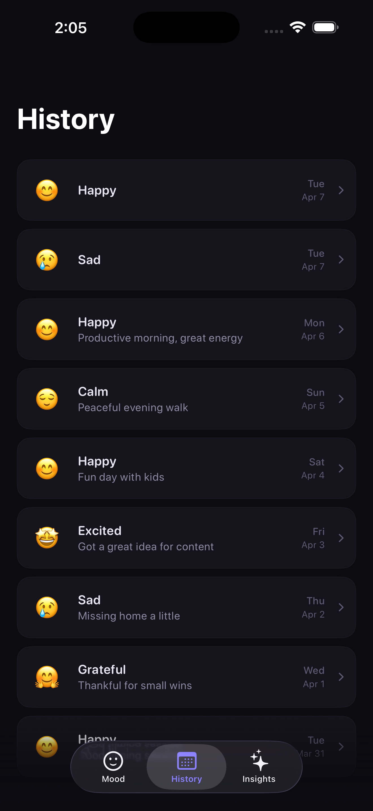
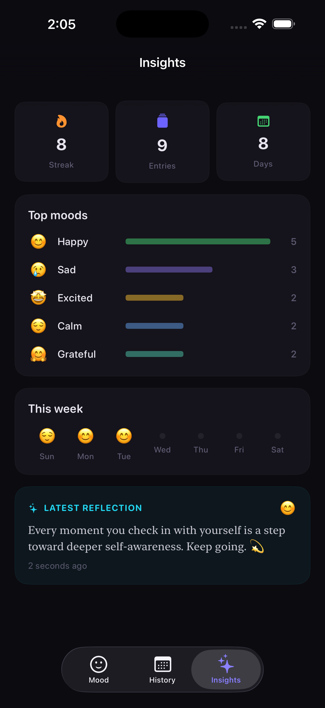

# MoodJournal

A simple iOS mood journaling app built with SwiftUI. Log how you're feeling with playful emoji bubbles, add notes, and get AI-powered reflections on your entries.

## Features

- **Emoji Bubble Picker** — Physics-based floating bubbles sized by how often you log each mood. Tap to select, with a satisfying pop animation.
- **AI Reflections** — Get a short, personalized reflection from Claude after each entry.
- **Mood History** — Browse past entries with expandable cards showing your notes and AI reflections.
- **Insights Dashboard** — Track your streak, top moods, weekly overview, and latest reflection at a glance.
- **Dark Theme** — Soft glows and a dark palette designed for comfortable journaling.

## Screenshots

  
  &nbsp;&nbsp;
  

## Requirements

- iOS 17.0+
- Xcode 16+

## Getting Started

1. Clone the repo
2. Open `MoodJournal.xcodeproj` in Xcode
3. Set your Claude API key in `ClaudeService.apiKey`
4. Build and run
